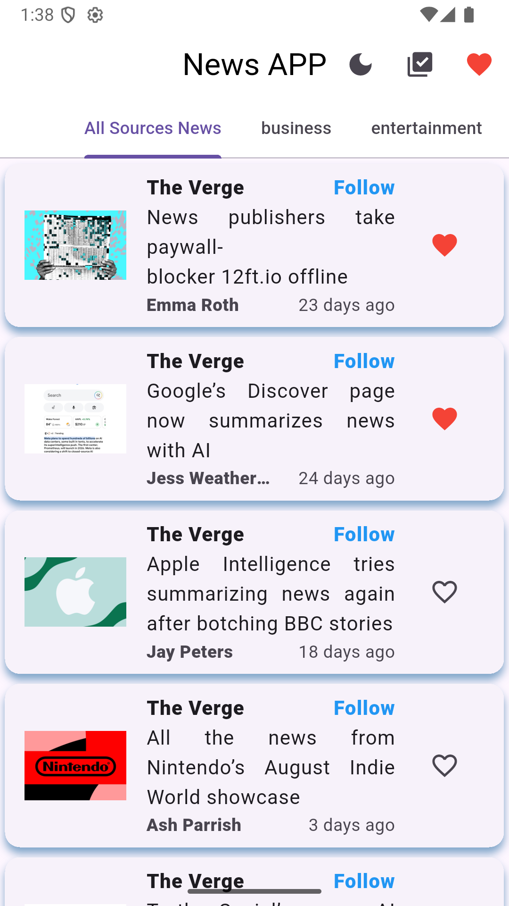
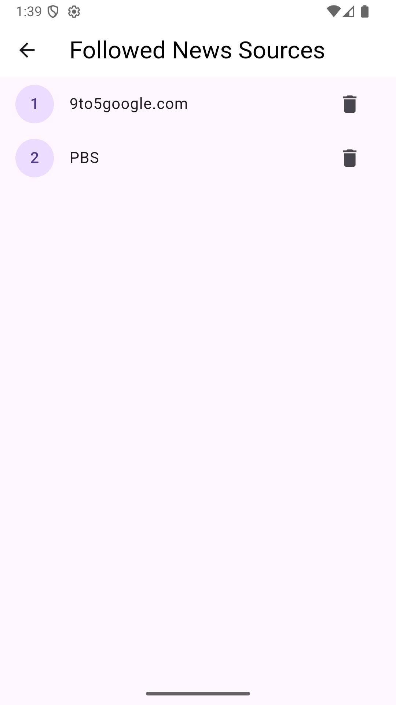
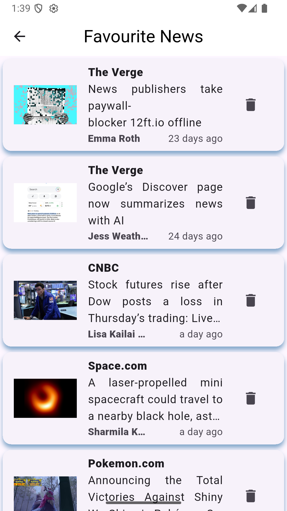
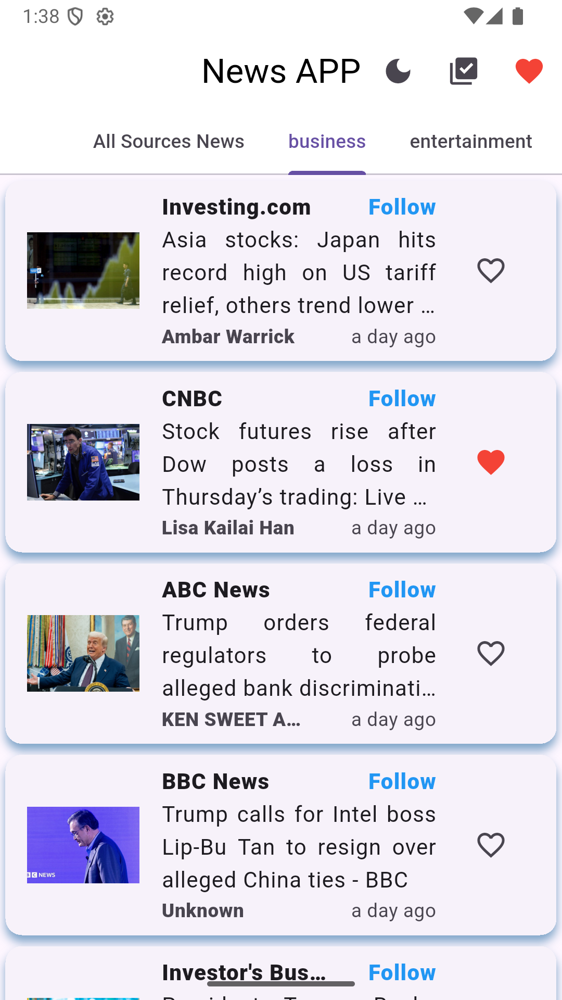
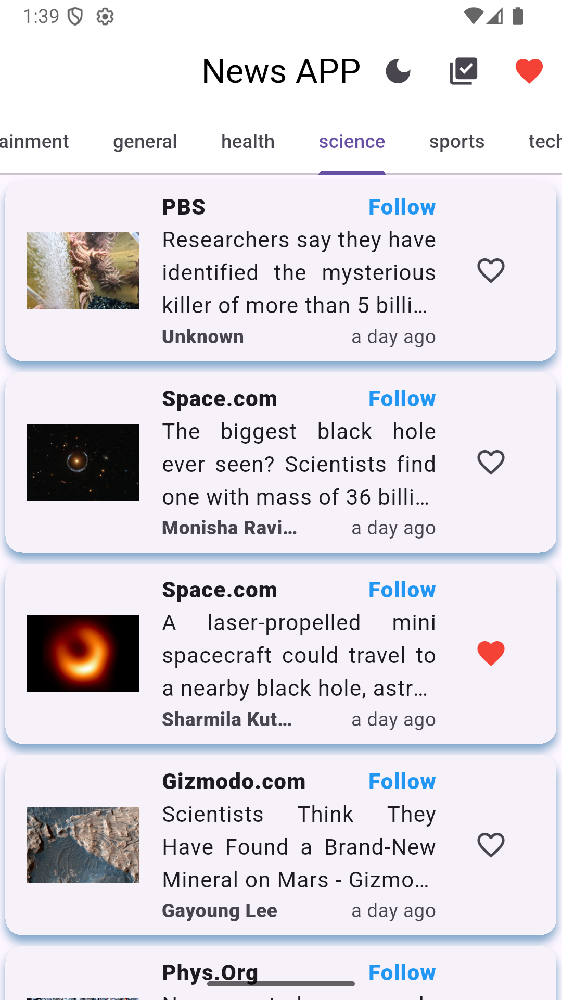
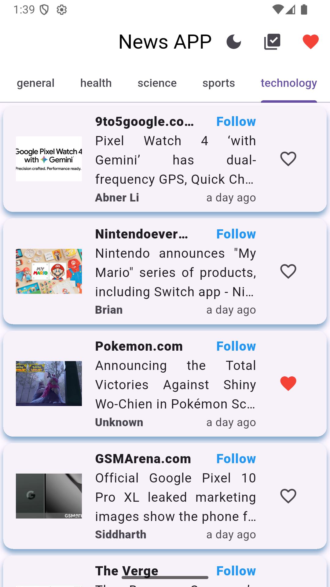
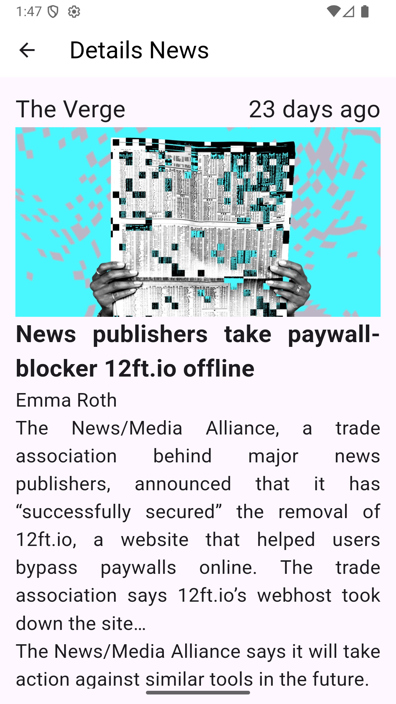
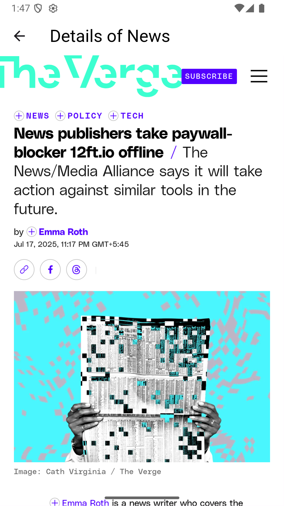

# 📰 Learning BLoC with News App

This project is a **News App** built while learning **BLoC state management** in Flutter.  
It fetches real-time news from [NewsAPI.org](https://newsapi.org/) and comes with multiple features like categories, liking news, following sources, and light/dark theme support.

---

## 🚀 Features

- **BLoC State Management** – Clean and maintainable architecture.
- **Fetch Latest News** from [NewsAPI.org](https://newsapi.org/) using the `http` package.
- **Like News Articles** – Save your favorite articles .
- **Follow News Sources** – Track your favorite publishers.
- **View Followed Sources** – Access all followed publishers in one place.
- **Browse News by Category** – Business, Technology, Sports, Entertainment, and more.
- **All Sources View** – Explore all available news sources.
- **Detailed News View** – Read article details in-app.
- **Open Original Article** – View the full article using the `webview_flutter` package.
- **Light & Dark Theme Toggle** – Switch themes anytime.

---

## 🛠️ Tech Stack

- **Flutter** – Cross-platform UI toolkit
- **BLoC (flutter_bloc)** – State management
- **http** – Fetch data from API
- **webview_flutter** – In-app browser
- **Equatable** – Simplify state and event comparisons

---

## 📸 Screenshots

### Home & Sources
|  |  |  |
|:-----------------------------:|:------------------------:|:------------------------:|
| Home Screen showing all news sources | Screen displaying followed news sources | Your list of liked/favourite news articles |

### Categories
|  |  |  |

### News Details
|  |  |

## 🔧 Setup

1. **Clone the repository**
   git clone https://github.com/your-username/news_app.git](https://github.com/JayaramDhungana/news_app_using_bloc.git
   cd news_app
2.**Install dependencies**
   flutter pub get
3.**Get your API Key from NewsAPI.org and add it to your configuration file.**
4.**Run the app**
   flutter run

   
### Learning Outcome
**This project helped me:**
Understand BLoC architecture for managing complex states.
Work with REST APIs in Flutter.
Implement theme switching.
Build modular and reusable UI components.
Understand WebView in FLutter

   
